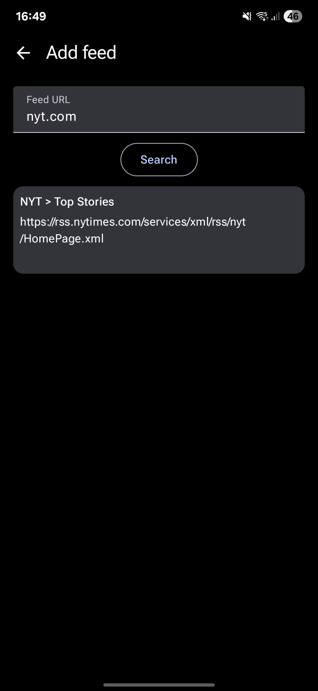

Una parte fundamental de la vida académica es mantenerse al tanto de las noticias, eventos y publicaciones importantes del campo. Para muchas personas, la manera más sencilla de hacerlo es siguiendo perfiles en redes sociales. Sin embargo, hay maneras de mantenerse al tanto sin quedarse horas mirando Instagram: los feeds de RSS.

## ¿Qué es RSS y por qué usarlo?

El formato [RSS (_Really Simple Syndication_)](https://es.wikipedia.org/wiki/RSS) es un formato estándar para compartir información recurrente en la web. Surgió a finales de los 90 y comienzos de los 2000, y sorprendentemente sigue vigente. Esto es porque es un formato increíblemente sencillo, pero poderoso, además de que es un estándar abierto, lo que permite que haya muchas aplicaciones que lo pueden leer.

Para mí, hay al menos tres razones para usar RSS hoy en día:

1. No depender de las redes sociales para estar enterado de publicaciones, eventos, y especialmente noticias. Desde la caída de Twitter ya es hora de que volvamos a pensar en consumir noticias online de manera más independiente.
2. RSS es un formato que, al no guardar cookies, no genera (tanto) rastreo. Por lo tanto, es un formato que respeta la privacidad.
3. Las redes sociales y muchas páginas web están diseñadas para mantenernos atadas a ellas mucho más de lo que querríamos. Esto lo hacen mostrándonos contenido adicional que podría gustarnos (y, por qué no, llevarnos a comprar un electrodoméstico más que no sabíamos que necesitábamos) pero al que no estamos suscritos. Un feed de RSS, en cambio, está un poco más bajo nuestro control, y no nos va a mostrar contenido por fuera de las fuentes a las que nos hayamos suscrito. Para algunas personas perder el algoritmo de recomendación es un problema, pero con tanta información disponible, yo lo veo como una ventaja enorme y una oportunidad de volver a curar adecuadamente el contenido que consumo online.

## ¿Cómo usar RSS (en general)?

Para usar RSS, hay dos ingredientes: un lector (o _cliente_) y una fuente.

Hay muchos tipos de lectores de RSS. Por un lado, podríamos usar un servicio web como [Feedly](https://feedly.com/news-reader) o [Feeder.co](https://feeder.co/), que nos permiten suscribirnos a fuentes de RSS de manera gratuita. También podemos usar aplicaciones para el computador como [NetNewsWire](https://netnewswire.com/) para MacOS o [NewsFlash](https://gitlab.com/news-flash/news_flash_gtk) en Linux. Sin embargo, para mí lo más conveniente es usarlo en mi celular, que es donde generalmente leería noticias de todas maneras. Para Android, recomiendo [Feeder](https://github.com/spacecowboy/Feeder) por ser una aplicación libre y de código abierto. También hay aplicaciones para otros lectores como Feedly.

Una vez tenemos un lector de RSS, tenemos que suscribirnos a una fuente. Podemos hacer esto de dos maneras. Para muchos sitios web, basta con poner la URL base del sitio en la aplicación para que ella detecte una fuente de RSS, en caso de que la página implemente bien su feed. Por ejemplo, podemos darle simplemente la URL `nyt.com` (para el New York Times) y la aplicación encontrará el feed que la página tenga configurado por defecto. Una vez nos suscribimos, la aplicación nos presentará las últimas publicaciones y las actualizará cada tanto.

  

Si la detección automática no funciona, es posible que de todas maneras haya un feed de RSS habilitado. Para eso podemos ir a la página que nos interesa y buscar este ícono: <i class="mx-1 fa-solid fa-square-rss text-orange-500"></i>. Este ícono nos dará el enlace para el feed al que nos podemos suscribir.

## ¿Cómo usar RSS (en la academia)?

Una ventaja de RSS es que no solo lo implementan las páginas de noticias, sino muchas otras páginas, incluyendo muchas revistas académicas, blogs ([¡incluyendo este!](https://www.juanrloaiza.com/rss.xml)) y otras fuentes. Usando la misma lógica de arriba, podemos suscribirnos a varias fuentes académicas para mantenernos al tanto.

En mi caso, por ejemplo, tengo suscripción por RSS a algunas revistas (enlaces a la fuente de RSS incluidos), como:

- [The British Journal for the Philosophy of Science](https://www.journals.uchicago.edu/action/showFeed?type=etoc&feed=rss&jc=bjps)
- [Emotion Review](https://journals.sagepub.com/action/showFeed?ui=0&mi=ehikzz&ai=2b4&jc=emra&type=axatoc&feed=rss)
- [Philosophical Psychology](https://www.tandfonline.com/feed/rss/cphp20)

También me suscribo a [Daily Nous](https://dailynous.com/) ([RSS](https://dailynous.com/feed)) mediante RSS para estar enterado de noticias y artículos más informales en la disciplina, y a algunos blogs como [Imperfect Cognitions](https://imperfectcognitions.blogspot.com/) ([RSS](https://www.blogger.com/feeds/4430111450575356526/posts/default)) (lamentablemente [The Brains Blog](https://philosophyofbrains.com/) no tiene RSS).

Pero sin lugar a dudas, lo mejor de usar RSS está en que puedo suscribirme a [Philos-L](https://www.liverpool.ac.uk/philosophy/philos-l/) ([RSS](https://listserv.liv.ac.uk/cgi-bin/wa?RSS&L=PHILOS-L&v=2.0)) mediante RSS. Para quienes no la conocen, Philos-L es una lista de correos enorme en donde se publican eventos y noticias a nivel mundial. Es una fuente invaluable de información sobre lo que ocurre en la disciplina. El problema es que, dado que es una lista de correos, suscribirse generalmente implica llenarse de correos (al menos hasta que uno encuentra la configuración para agruparlos en "digests" de unas 15 publicaciones diarias). Suscribirse a Philos-L por RSS me permite en cambio navegar los miles de publicaciones diarias en una aplicación sin llenarme de correos que llegan cada diez minutos, marcar las publicaciones que me interesan como favoritos, buscar entre ellos, etc.

## Y para quienes manejan páginas web

Para quienes tenemos blogs personales o profesionales, les invitaría a buscar cómo implementar RSS para facilitarle a otras personas usarlo para suscribirse. Esta página, por ejemplo, está implementada en [Astro](https://astro.build/), y fue supremamente fácil implementar un feed de RSS para este blog usando [@astrojs/rss](https://docs.astro.build/en/recipes/rss/).

También podemos crear fuentes de RSS para dar información sobre otros tipos de cosas. Por ejemplo, en mi grupo de investigación, [Santiago Mind and Cognition](https://www.santiagomindandcognition.cl/), tenemos un [feed de RSS](https://www.santiagomindandcognition.cl/events.xml) sobre todos los eventos que hacemos.

Para mí, ha sido verdaderamente refrescante tener un mecanismo para enterarme de las noticias, eventos y publicaciones sin depender de las redes sociales, además de proteger mi privacidad y usar un estándar libre. Esperemos que esta tecnología se mantenga, como lo ha hecho desde hace más de 20 años.
